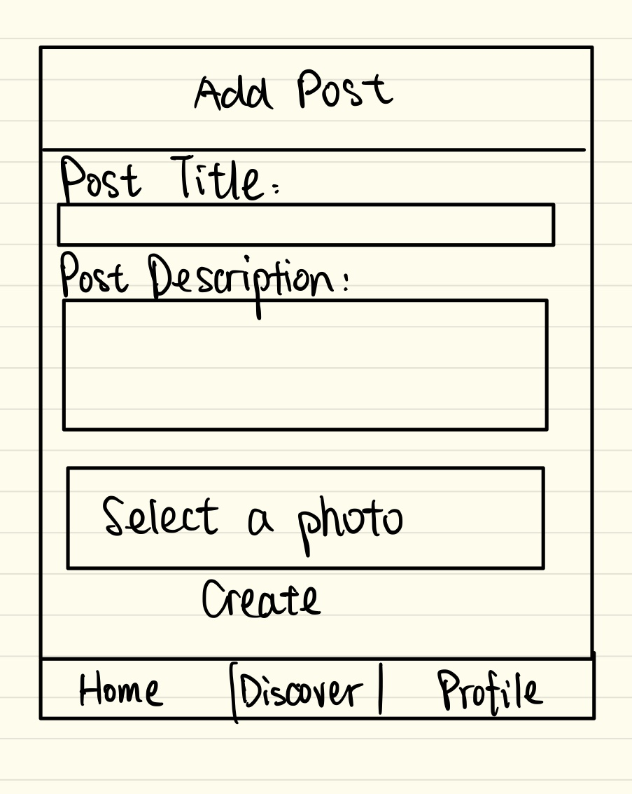
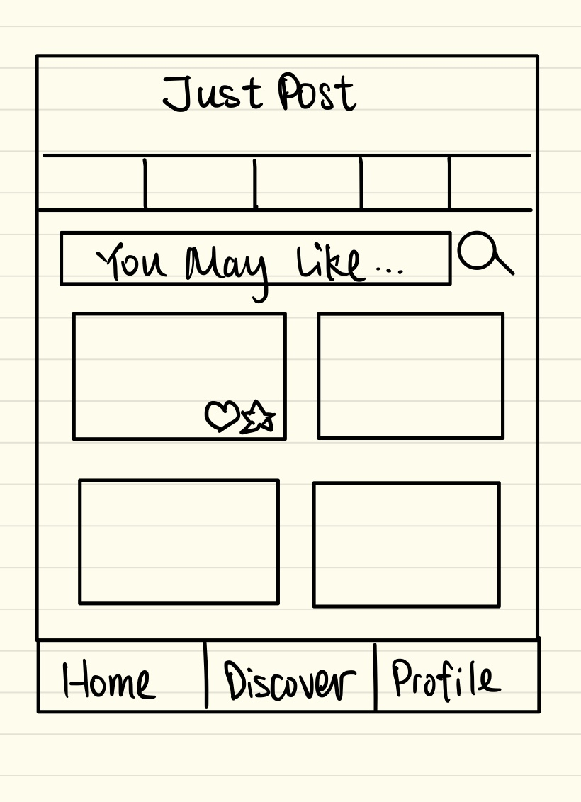
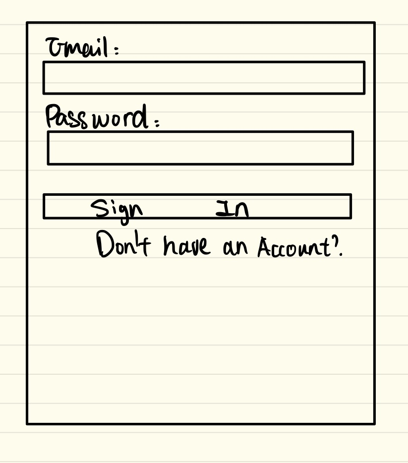
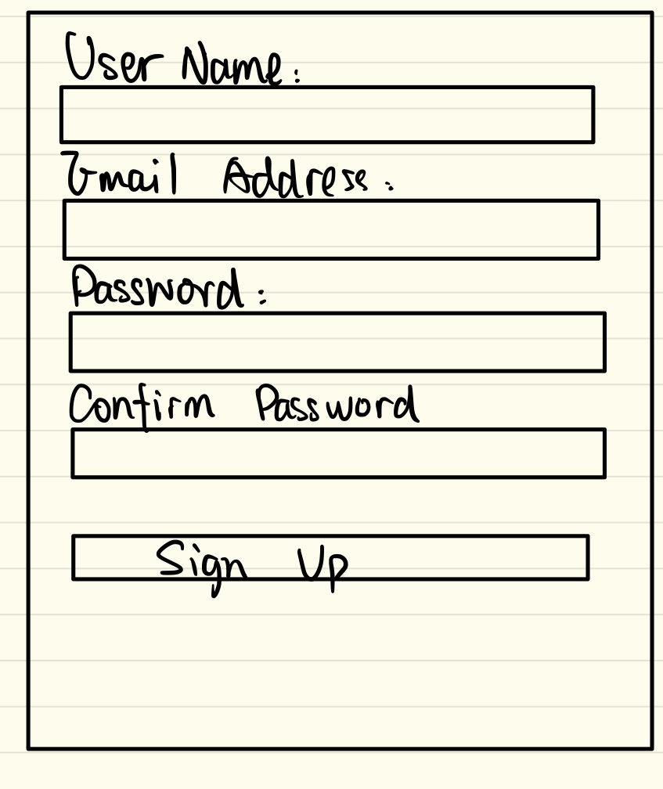

# JustPost/Project 18

## Iteration 02

 * Start date: Oct 27
 * End date: Nov 2

## Process

We made a plan of what we can do for this deliverable and complete the set up step.

#### Roles & responsibilities

- Tong Li: UI of SignupPage, SigninPage, ProfilePage, Markdown files
- Xiawei Zhang: FrameWorks desgin, setting up API page, FrontEnd coding, BackEnd coding, MainNavigator Design
- Yiming Zhang: Post Detail page, BackEnd coding, SiginPage and SignUpPage Front-Back interaction, SignIn and SignUp navigation design
- Wei Lu: Post Main page, Create Post page
- Yichen Xu: modify of SignupPage, SigninPage, PostDetail and edit Markdown files
- Jincheng He: Backend coding, connect to database, Profile api code writing

#### Events

We met at BA2210 on Saturday, in-person. The purpose of the meeting is to decide what to do for the deliverable 2 and search for resource that we could use for setting up our application.
We met at tutorial on Tuesday, in-person. We exchanged what everyone has done for the project, and problem we met. We modify the content we could complete for deliverable 2.
We met at BA2210 on Thursday, in-person. We discuss the main problems and solve together.  
We met at BA2210 on Friday, in-person. To discuss the issues and figure out each problems and solve in the order of importances.

#### Artifacts
  
First of all, we will focus on the Post part (create post, post browser) by building up the UI page first since posts is the most important part of this application. During this period of time, each or part of the team members will be assigned to one or more pages. After that, a database needed to be created and the api needed to be implemented to allow data flow between frontend and backend. User pages can be assigned to some team members now, and most of the team members will be involving to writing the api implementation at this moment. Each feature (like, collect, comment) should be implemented in order based on its difficulty, and be tested to ensure working well.

#### Git / GitHub workflow  

We are using fork & pull workflow. Each team member forks from the repository, and works on each parts as discussed before. Most of the files are written by one person once a time. Every time each team member finish his/her part, they will use git add, git commit, git push to push the modified files to the personal repository. After that, a pull request will be raised on the personal repository to require for approvement of the changes from original repository, and the code can be merged into the repository. Every team member has the right to reviews the pull-requests, therefore, everybody is responsible for code reviewing and make sure there is no conflict in the pull request, or the conflict will be solved before the new code is merged into the original repository. Since conflicts will happen if two members are modifying one page, therefore, we are avoiding to assign a page to two or more members at the same time.

## Product

#### Goals and tasks

* Implements the UI for the application, especially the post browser and the create post screens.
* Finish the basic data flow from the frontend and backend. For example, we can create post and send data collected to the database, and load the post in the discover page by dragging data from the database. In order to do so, we need to create a database and establish the link between the data in the frontend and the datatbase's.
* Users are able to signin and signup, and only users can have the permission to view and create the posts.
* Users can LIKE the posts which they are interested in, and the posts will count the numbers of like they get.

#### Artifacts

   
* Add post is the screen for creating post, where people can create a new post with text and image they would like to share. And the posts created successfully would be able to be viewed in the homepage of the application, which can also be considered as the browser of posted posts.
 
* Home page for Just Post, which has lists of posts created by the users, and it is uploaded after posts created by the users, and there is a button to refresh to load new posts.
 
* Sign in page is used for the existed users to sign in, and there is also a link for the new users to direct to the signup page.
 
* Sign up page for the new users to sign up, and the data will be collected to the database if the data are valid.

