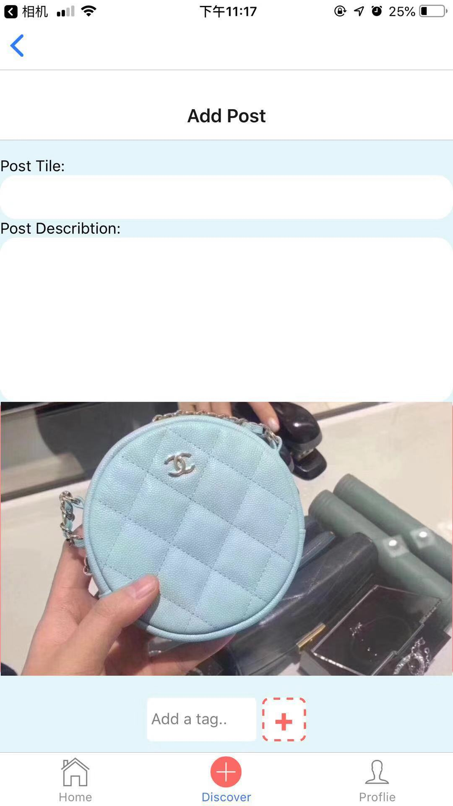
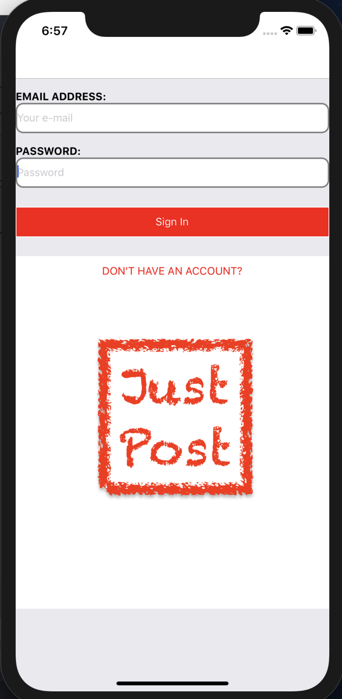
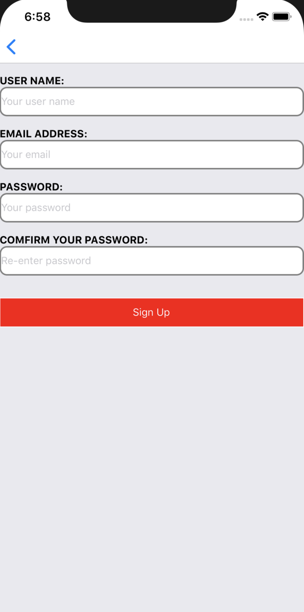

# JustPost/Project 18

## Iteration 2 - Review & Retrospect

 * When: Nov 1
 * Where: BA2210
## Process - Reflection

We have mainly done the sketch of our app, although there are some feature not implemented.

#### Decisions that turned out well

List process-related (i.e. team organization) decisions that, in retrospect, turned out to be successful.

1. We managed to find a good structure i.e. React Native and database i.e. Firebase, which could provide us with a good start and reduce our work at set up step so that we can focus more on the solid contents of the app.
2. We managed to create the sketch of front end quickly that give us a good direction of how to implement out ideas on the app and what methods on the back end are needed to implement specifically.

#### Decisions that did not turn out as well as we hoped

List process-related (i.e. team organization) decisions that, in retrospect, were not as successful as you thought they would be.
1. The timing issue influenced the process of development. Since team members are all busy at mid-term period, our meeting was not frequent and the main stuff were completed just before deadline.
2. We planned to let 1 guy to design the front end and 1 guy to connect the front end with back end, and others to construct the back end, but it turns out that it was not so easy to responsible for the front end and connection job for only two people. People responsible for the back end should communicate frequently and work together with people responsible for the front end so that our work would be efficient.

#### Planned changes

List any process-related changes you are planning to make (if there are any)

 Nothing changed.

## Product - Review

#### Goals and/or tasks that were met/completed:

1. Create user interface
2. Able to add post 
3. Able to browse post
4. Able to sign in & sign up
5. Able to search post according to tag
6. Able to look top view post & top like post
7. Able to like post

  
 

#### Goals and/or tasks that were planned but not met/completed:

1. Recommend different content according to different user.
	It is not so easy to implement due to the timing issue, and it needs certain algorithm to support it, which we need to learn first.

2. Comment on a certain post.
	Due to timing issue.

3. Share post to other social media
We have not got certain idea of how to implement this and we think it is a feature that will be added if and only if we are good with the basic thing in our app.
 * From most to least important.
 * For each goal/task, explain why it was not met/completed.      
   e.g. Did you change your mind, or did you just not get to it yet?

## Meeting Highlights

Going into the next iteration, our main insights are:

1. The recommendation system will be set.
2. The comment system will be improved.
3. The sharing feature.

