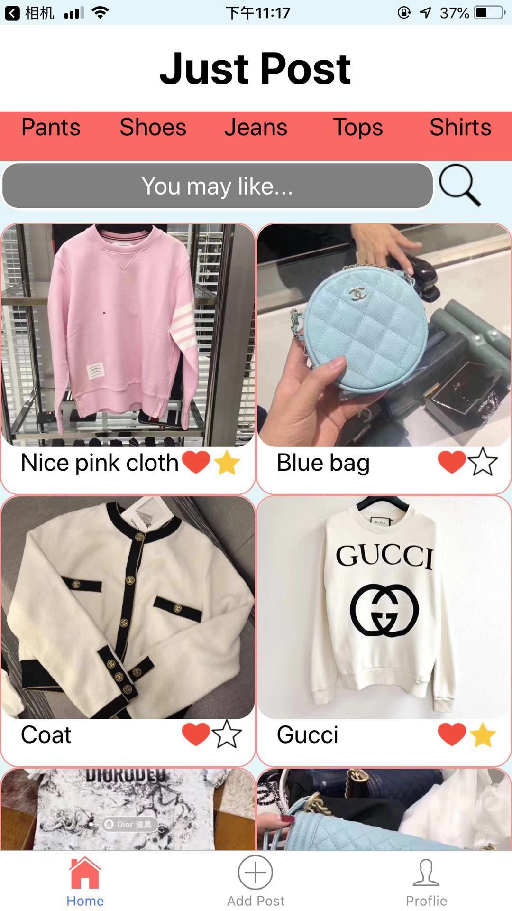
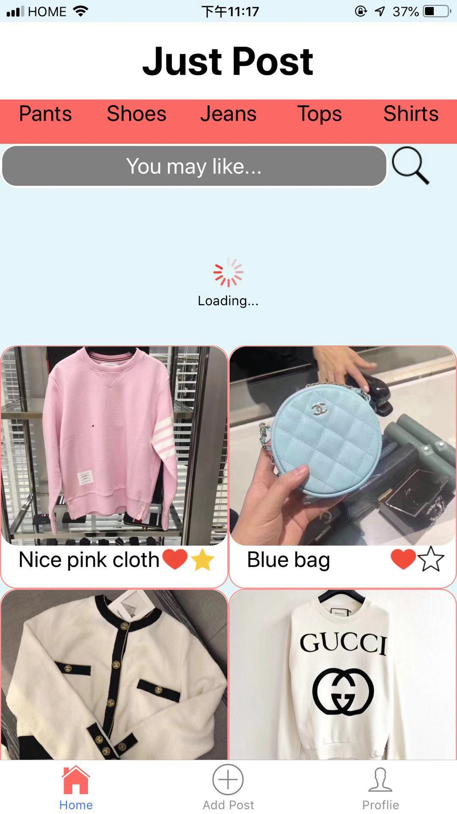
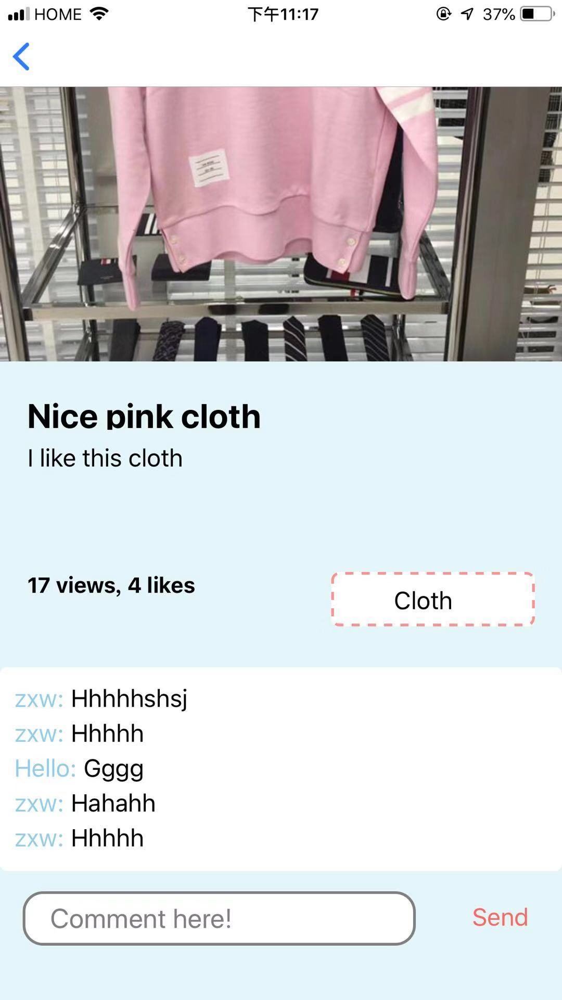
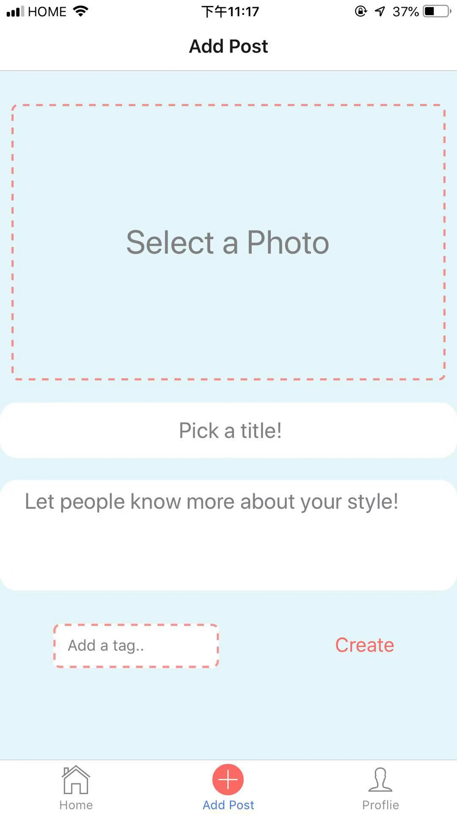
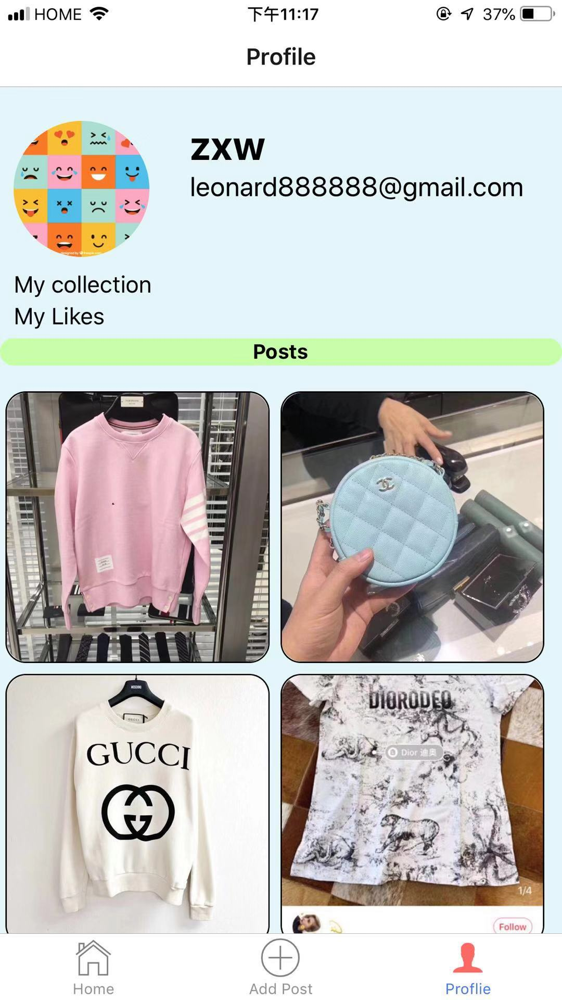
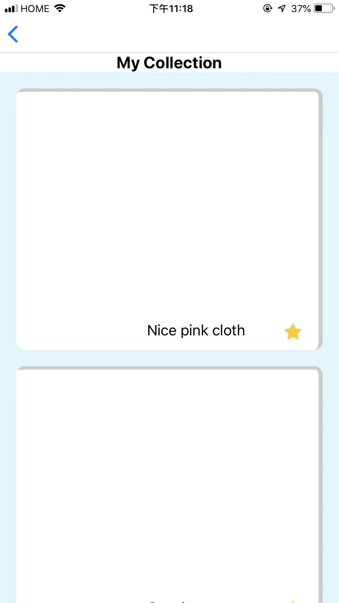
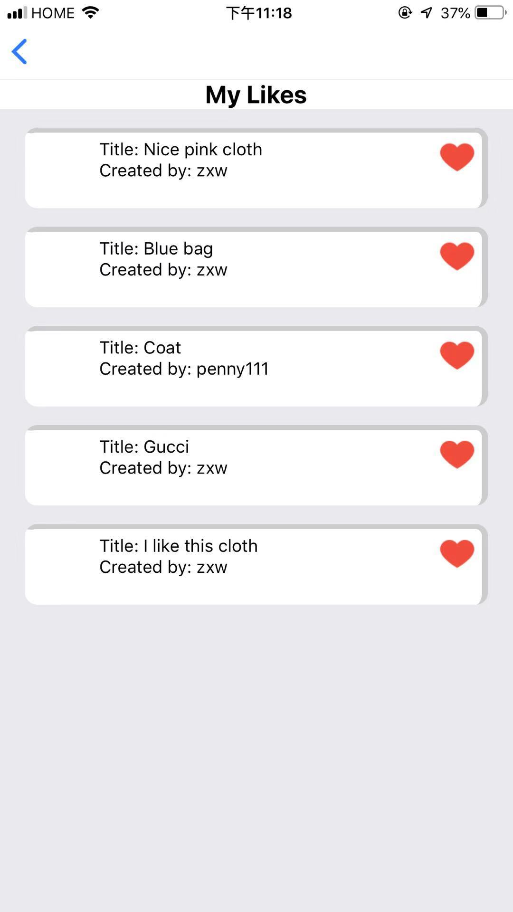

# JustPost/project-teamt-18

## Iteration 3 - Review & Retrospect

 * When: Nov 29
 * Where: BA2210

## Process - Reflection

We have done our project and the app is well functional.

#### Decisions that turned out well

1. We have our main post interface be able to refresh by scrolling down and load more posts by scrolling up instead of tapping bottoms, because it makes our app more modern.
2. We managed to add a lot of functions that a traditional social media app has. For example, search tags, make comments, collections and likes. This makes our app easy to use for users.

#### Decisions that did not turn out as well as we hoped

1. The timing issue influenced the process of development. Since team members are all busy at final approaching period, our meeting was not frequent and the main stuff were completed just before deadline. 
2. We lost one of our team member after reading week, so some functions are not able to be implemented.
3. We planned to make too many functions for our app and we finished a lot, but there are still some functions that we cannot finish completely. Like tag, we are not able to add multiple tags for a post, but if we have more time, we can do this.

#### Planned changes

List any process-related changes you are planning to make (if there are any)

 * Ordered from most to least important.
 * Explain why you are making a change.
1. Due to timing issue, we are not able to add multiple tags for one post, so we change it to add one tag for each post.
2. We planned to have the likes, collection interface and myPost interface all in our profile interface, and using three buttons to switch among them, but due to technology restriction, we changed the like and collection interface into two independent interfaces and using two buttons in the profile page to navigate to them.

## Product - Review

#### Goals and/or tasks that were met/completed:

 * From most to least important.
 * Refer/link to artifact(s) that show that a goal/task was met/completed.
 * If a goal/task was not part of the original iteration plan, please mention it.
1. Scroll down to refresh (This feature is not part of the original iteration plan, but we found it more modern in social media app so we decided to add it.)
2. Scroll up to loading (This feature is not part of the original iteration plan, but we found it more modern in social media app so we decided to add it.)
3. Add tag
4. Create collection interface
5. Create like interface
6. Able to make comment

   
  
  
  
  
  

#### Goals and/or tasks that were planned but not met/completed:

1. Most view. We have the function of most view in the back end, but due to the loss of one team member, we were not able to finish it.
2. Recommend different content according to different user. It is not so easy to implement due to the timing issue and loss team member, and it needs certain algorithm to support it, which we need to learn first.
3. We planned to have users subscribe each other, so we have the potential ability to create public accounts which can attract companies to use our app.
4. We planned to have a live chat function so it has the app can have the most basic function a social media app have.
5. We planned to have a link to the buyer on every post if provided, so the app can connect to other shopping app, which can create commercial value for our app.

## Meeting Highlights

Going into the next iteration, our main insights are:

1. Improve our tag system to be able to add multiple tags on a post.
2. Add the recommendation system.
3. Beautify our interface.

